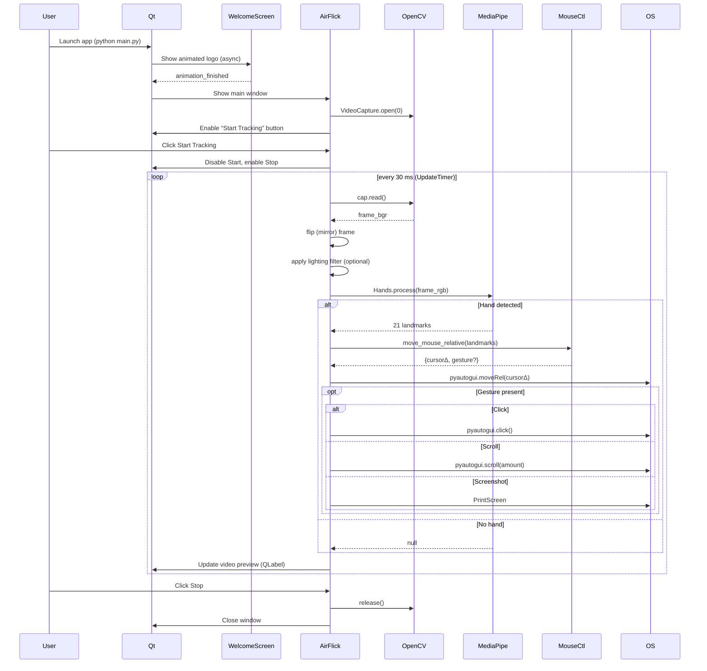

# AirFlick - Gesture-Based Mouse Control

## Overview
AirFlick is an innovative application that transforms hand gestures into mouse control using computer vision. With AirFlick, you can interact with your computer through intuitive hand movements, providing a touchless and futuristic user experience.

## Features
- **Gesture-Based Mouse Control**: Move the cursor, click, scroll, and perform other mouse actions using hand gestures.
- **Customizable Settings**: Adjust sensitivity, smoothness, and scroll speed to tailor the control experience to your preference.
- **Lighting Filters**: Enhance gesture detection in various lighting conditions with low light and high light compensation filters.
- **Intuitive UI**: User-friendly interface built with PyQt6 for seamless interaction.

## How It Works
AirFlick uses a webcam to capture hand movements, processes them using advanced computer vision algorithms, and translates them into mouse actions. The core components include:

- **Hand Detection**: Utilizes the `HandDetector` class to identify and track hand landmarks.
- **Mouse Controller**: The `MouseController` class maps hand gestures to mouse movements and actions.
- **UI Components**: Built with PyQt6, providing video feedback and settings customization.

## Installation
1. Clone this repository to your local machine.
2. Ensure you have Python 3.10 installed.
3. Install dependencies:
   ```bash
   pip install -r requirements.txt
   ```
4. Run the application:
   ```bash
   python main.py
   ```

## Requirements
See `requirements.txt` for the full list of dependencies. Key libraries include:
- OpenCV (`cv2`) for video capture and processing
- PyQt6 for the graphical user interface
- NumPy for numerical operations

## Usage
- Launch the application and allow webcam access.
- Use the 'Start Tracking' button to begin gesture control.
- Move your index finger to control the cursor.
- Perform gestures for clicking, scrolling, and other actions as detailed below.
- Adjust settings via sliders for a personalized experience.
- Use 'Stop' to pause gesture tracking.

## Controls and Settings
Airflick provides several adjustable settings to fine-tune your gesture control experience:
- **Sensitivity Slider**: Adjusts how responsive the cursor is to hand movements. Higher values make the cursor move faster with smaller hand movements (Range: 2 to 8).
- **Smoothness Slider**: Controls the smoothing effect on cursor movement to reduce jitter. Higher values result in smoother but potentially slower response (Range: 0.1 to 1.0).
- **Scroll Speed Slider**: Determines the speed of scrolling when using scroll gestures (Range: 0.1 to 2.0).

## Filters for Optimal Detection
Airflick includes lighting filters to improve hand detection under various conditions:
- **Low Light Filter**: Enhances visibility in dim environments by adjusting the image brightness. Enable this when working in poorly lit areas to improve gesture recognition.
- **High Light Filter**: Compensates for overly bright environments by applying **gamma correction** (γ < 1). This slightly darkens highlights, reduces glare, and restores skin-tone detail. Note: Only one filter can be active at a time.

### Why these two filters?
| Scenario | Technique | Why it fits AirFlick |
|----------|-----------|----------------------|
| Room too **dark** | **CLAHE** on the L channel (in LAB colour-space) | • Works on *local* tiles so it brightens shadows without washing out the whole frame.<br>• Limits contrast amplification → avoids speckle noise.<br>• Fast (<1 ms @ 640 px) and implemented in OpenCV C++ → perfect for a 30 fps loop.
| Room too **bright / back-lit** | **Simple gamma correction** LUT (γ≈0.75) | • Darkens only the bright end, retaining mid-tone detail.<br>• One-time 256-value LUT → negligible CPU cost.<br>• Colour-preserving (works per channel) so hand-skin hue remains valid for ML model.

Both methods are **deterministic and lightweight**, so they do not introduce extra latency that could make the cursor feel laggy on low-power laptops.

### Other filters we evaluated & why we skipped them
| Candidate | Pros | Cons for real-time use |
|-----------|------|------------------------|
| Global Histogram Equalisation | Extremely easy to implement | Tends to over-amplify noise / glare, creates flicker between frames.
| Homomorphic / Retinex (SSR/MSR) | Excellent dynamic-range compression | Requires multiple blurs & logarithms → 5-10× slower; visible colour shift; overkill for single-hand detection.
| Adaptive Gamma / `cv2.createTonemap` | Fine-grained tone control | Still ~3-4× slower than LUT; extra OpenCV contrib dependency.
| Bilateral / Guided Filter | Smooths noise while keeping edges | High computational cost (especially bilateral). Doesn’t solve contrast problems by itself.
| Deep-learning auto-exposure (e.g. Zero-DCE) | State-of-the-art quality | Model size & GPU requirement not acceptable for a lightweight desktop utility.

> In short, **CLAHE + gamma LUT** provided the best trade-off between _quality_, _speed_, and _implementation simplicity_ for our 30 fps, CPU-only pipeline.


## Gestures
Airflick translates specific hand gestures into mouse actions for intuitive control. Below are the primary gestures supported:
- **Cursor Movement**: Extend only your index finger and move your hand to control the cursor position on screen. Other fingers should be folded down.
- **Left Click**: Form a pinching gesture with thumb and index finger (distance less than 0.04 normalized units) to simulate a left mouse click.
- **Right Click**: Form a pinching gesture with thumb and middle finger (distance less than 0.04 normalized units) for a right mouse click.
- **Scroll Up**: Perform a thumbs-up gesture with thumb extended upward and other fingers folded to scroll up. The speed depends on the scroll speed setting.
- **Scroll Down**: Perform a thumbs-down gesture with thumb extended downward and other fingers folded to scroll down. The speed depends on the scroll speed setting.
- **Screenshot Trigger**: Bring all five fingertips close together (pairwise distance less than 0.1 normalized units) to trigger a screenshot. This activates the OS screenshot tool (PrintScreen on Windows/Linux).

Additional gestures for advanced controls are being developed and will be documented as they are implemented in `mouse_controller.py`.

## Project Structure
- `main.py`: Main application file that integrates all components.
- `hand_detection.py`: Contains the logic for detecting and tracking hand landmarks.
- `mouse_controller.py`: Handles the conversion of hand movements to mouse actions.
- `welcome_screen.py`: Displays the initial splash screen.
- `screenshot_trigger.py`: Manages screenshot functionality via gestures.
- `air_flick.ui`: UI definition file for the PyQt6 interface.


# AirFlick – Internal Flow & Processing Guide

This document offers a **deep-dive** into how AirFlick works under the hood – from
application start-up, through every video frame, to the final mouse / keyboard
action that the operating-system receives.

---

## Key Features

* **Gesture-driven Cursor Control** – move the mouse pointer with your index finger.
* **Click Gestures** – thumb-index pinch = left click, thumb-middle pinch = right click.
* **Smooth Scrolling** – thumbs-up to scroll up, thumbs-down to scroll down, speed set by slider.
* **Screenshot Gesture** – touch all five fingertips together to press PrintScreen.
* **Adaptive Lighting Filters** – quick low-light CLAHE and high-light gamma correction.
* **User-Tunable Sensitivity & Smoothing** – sliders for scaling_factor, smooth_factor, scroll speed.
* **On-Screen Video Preview** – live annotated feed aids calibration and confidence.
* **Virtual Keyboard** – draggable, always-on-top keyboard for text entry without physical keys.
* **Sleek Welcome Screen** – animated splash before main window appears.

---

## 1. Application Life-cycle

| Stage | Key Classes / Files | Description |
|-------|--------------------|-------------|
| Splash screen | `welcome_screen.py` | Shows an animated logo while `AirFlick` is prepared. When the animation (or a 5 s safety timer) finishes it emits `animation_finished` so the main window is revealed. |
| Main window | `main.py → class AirFlick` | Loads `air_flick.ui`, initialises helpers (`HandDetector`, `MouseController`, `ScreenshotTrigger`, `VirtualKeyboard`) and sets up all **Qt** signals / slots. |
| Runtime loop | `AirFlick.update_frame` (30 ms via `QTimer`) | Captures a frame, preprocesses it, runs hand detection, gesture recognition, cursor / click / scroll logic, then converts the annotated frame back to `QImage` for the video preview. |
| Shutdown | `AirFlick.closeEvent` | Stops camera, releases resources, and triggers a final GC pass. |

---

## 2. Capturing a Frame

1. `AirFlick.start_camera()` opens the first webcam with **OpenCV**:
   ```python
   self.cap = cv2.VideoCapture(0)
   ```
2. Every 30 ms `update_frame()` executes:
   ```python
   ret, frame = self.cap.read()            # BGR image from webcam
   frame = cv2.flip(frame.copy(), 1)       # Mirror for natural interaction
   ```

---

## 3. Pre-processing Pipeline

Pre-processing is **lightweight** – only two optional filters can run and they
are mutually exclusive, selected by two toggle buttons bound to
`toggle_low_light_filter` / `toggle_high_light_filter`.

| Filter | When Enabled | Function | What It Does |
|--------|--------------|----------|--------------|
| None | default | – | Frame passes through unmodified. |
| Low-light (CLAHE) | `self.low_light_filter_enabled` | `preprocess_for_hand_detection()` |
| • Convert BGR → LAB.<br>• Apply **C**ontrast **L**imited **A**daptive **H**istogram **E**qualisation to *L* channel.<br>• Merge, convert back to BGR. |
| High-light (Gamma) | `self.high_light_filter_enabled` | `preprocess_for_high_light()` | Builds a LUT to apply γ = 0.75 (darken) using `cv2.LUT`, reducing glare. |

Because the frame is mirrored **before** filters, both filters work on display
natural orientation.

```python
if self.low_light_filter_enabled:
    processed = self.preprocess_for_hand_detection(frame)
elif self.high_light_filter_enabled:
    processed = self.preprocess_for_high_light(frame)
else:
    processed = frame
```

The **processed** frame is what every downstream module uses.

### Filter overview & speed constraint

We tried to keep pre-processing **extremely fast** (≤1 ms) so that the 30 fps loop is never bottlenecked. Two pragmatic choices emerged:

| Technique | When it shines | Why AirFlick chose / rejected |
|-----------|----------------|------------------------------|
| **CLAHE (local histogram equalisation)** | Under-lit rooms where the hand is lost in shadow | ✔ Provides *local* contrast boost without blowing out bright parts.<br>✔ Built into OpenCV in C++, so the cost is trivial.<br>✖ Slight grain amplification, but negligible at webcam resolutions. |
| **Gamma LUT (γ = 0.75)** | Over-exposed scenes, strong back-light, white screens | ✔ Single **lookup table** → constant-time.<br>✔ Darkens only highlights so skin tone regains detail.<br>✖ Not adaptive: if lighting is extremely uneven the result may still clip. |
| Global histogram equalisation | Simple one-call API | ✖ Over-boosts noise in dark patches; washed-out skin tones; CPU cost comparable to CLAHE but *worse* visual outcome. |
| Adaptive gamma / Retinex | Handles severe mixed lighting | ✖ Heavier math (log & convolution) → 3-4 ms / frame; not needed for typical office/home lighting. |
| White-balance correction | Fixes colour cast | ✖ Doesn’t address brightness/contrast, so gesture detection gained little; skipped for latency. |
| Denoising (bilateral/median) | Removes sensor noise | ✖ Blurs fine finger edges used by MediaPipe; any benefit outweighed by landmark accuracy drop. |

By selecting **exactly one** of the two fast filters we cover the vast majority of real-world desktop setups while staying well below our per-frame time budget.

### 3.1 Low-Light Enhancement – alternatives considered
| Candidate | Pros | Cons |
|-----------|------|------|
| Simple brightness gain (`cv2.convertScaleAbs`) | Trivial CPU cost; easy to tune | Lifts *all* pixels equally → quickly clips highlights and makes skin look washed-out. |
| Global histogram equalisation (`cv2.equalizeHist`) | One-liner; stronger than plain gain | Boosts sensor noise, especially in dark backgrounds; creates flicker frame-to-frame. |
| Multi-scale Retinex | State-of-the-art for extreme low-light | Heavy FFT-based math (≥5 ms / frame); dependence on scene parameters; overkill for webcam chat lighting. |

**Why did we finally pick CLAHE?**  It executes in under **0.5 ms**, brightens only the shadowed regions thanks to local contrast mapping, and is available as a zero-copy C++ routine in OpenCV—giving the best *visibility-vs-latency* trade-off for webcam input.

### 3.2 High-Light Compensation – alternatives considered & rationale
| Candidate | Pros | Cons |
|-----------|------|------|
| Adaptive tone-mapping (`cv2.createTonemapDrago`) | Preserves highlights & shadows | Requires HDR-like input or multiple exposures; adds ~4 ms / frame. |
| CLAHE with **lower** clipLimit | Also tamps down highlights | Works, but CLAHE is really aimed at low-light – lowering clipLimit often under-exposes mid-tones. |
| Inverse gamma **per-channel** (auto-β) | Can adapt per frame | Needs histogram analysis each frame → extra CPU, and can cause colour shifts. |

**Chosen approach – fixed Gamma LUT (γ = 0.75):** a pre-computed 256-entry lookup table built once at start-up applies the correction in a single call to `cv2.LUT`, running in ≈0.2 ms on HD frames. It darkens blown-out highlights enough for MediaPipe to see finger contours while leaving mid-tones intact, and never introduces colour banding.

We settled on a **fixed gamma LUT (γ = 0.75)** because it removes glare *predictably* with virtually zero overhead – perfect for live gesture tracking.


---

## 4. Hand Detection

Handled by `hand_detection.py → class HandDetector` (a thin wrapper around
**MediaPipe Hands**):

```python
self.hands = mp.solutions.hands.Hands(
    static_image_mode=False,
    max_num_hands=1,
    min_detection_confidence=0.7,
    min_tracking_confidence=0.7,
    model_complexity=0   # lite model for speed
)
```

Algorithm:
1. Convert frame to RGB (MediaPipe requirement).
2. (Performance hint) If width > 640 px the frame is down-scaled first.
3. Call `self.hands.process()` which returns **21 landmarks** / hand.
4. Re-draw landmarks on the **original resolution** frame using
   `mp.solutions.drawing_utils`.
5. Return `(frame_with_landmarks, multi_hand_landmarks)` to caller.

`AirFlick` uses only the **first** detected hand.

---

## 5. Gesture Recognition & Mouse Mapping

All gesture logic lives in **`mouse_controller.py`**.  It receives the current
`hand_landmarks` plus a reference to its own `HandDetector` instance to reuse
existing helper functions.

### 5.1 Cursor Movement (Relative)
* Condition: **Only index finger is extended** – method
  `MouseController.is_index_finger_only()` checks index tip < PIP *and* every
  other finger folded.
* Movement: `move_mouse_relative()` computes the **delta** between current & previous
  fingertip coordinates, multiplies by a user-set **scaling_factor** (2 – 8) and then
  sends that relative offset to `pyautogui.moveRel()`.
* Natural acceleration: because the delta is based on *how far* the finger moves in a
  30 ms slice, **large/fast swings** produce bigger deltas → the pointer darts across
  the screen; **tiny/slow adjustments** yield sub-pixel deltas after smoothing →
  perfect for precision work, just like a conventional optical mouse that ramps up
  speed when you fling it.
* Jitter reduction: an exponential **smooth_factor** (0.1 – 1.0) blends the latest
  delta with the previous one so micro hand tremors are masked while still allowing
  brisk movements to shine through.
* Screen bounds: before the first move the code caches the screen resolution with
  `pyautogui.size()`; subsequent relative moves are naturally clamped by the OS.

> **How this mimics a conventional mouse**  
> 1. **Relative Delta = Hand Velocity** – A physical mouse measures how far the sensor travelled on the desk between polls; AirFlick does the same in mid-air by measuring how far your fingertip travelled between 30 ms frames.  
> 2. **User ‘DPI’ = scaling_factor** – The slider (2–8) simply multiplies that delta – exactly like changing DPI in Windows settings, so you can match the pointer speed you are used to.  
> 3. **Acceleration Curve Emerges Naturally** – Because the delta is proportional to distance moved per frame, faster hand motions automatically generate larger deltas, giving the same ‘accelerate when you flick’ feel without any extra maths.  
> 4. **Enhance Pointer Precision = smoothing** – The exponential blend dampens sudden sign changes and micro-jitters, equivalent to the OS option that averages raw motion for steadier fine control.  
> 5. **Zero to Screen Edge** – We don’t force absolute mapping; instead we keep adding relative deltas until the OS reports that the cursor hits an edge. This mirrors how you pick up and reposition a traditional mouse if you run out of desk space.  
> Together these steps make the cursor respond with familiar inertia and precision, so seasoned mouse users feel at home after a few seconds of hand-waving.

### 5.2 Clicks
| Action | Detector | Trigger condition (normalised landmark distance)|
|--------|----------|--------------------------------------------------|
| **Left** | `is_left_click()` | Thumb-tip ↔ Index-tip < 0.04 |
| **Right** | `is_right_click()` | Thumb-tip ↔ Middle-tip < 0.04 |

A per-gesture cooldown (0.1 s) prevents multiple clicks per frame.

### 5.3 Scroll
| Action | Detector | Helper in `HandDetector` | Extra Logic |
|--------|----------|--------------------------|-------------|
| Scroll Up | `is_thumbs_up()` | Thumb above other fingers, hand vertical | `perform_scroll("up")` sends `pyautogui.scroll(+amount)` where `amount = scroll_speed_factor × base`. |
| Scroll Down | `is_thumbs_down()` | Thumb below palm | Same, negative amount. |

`scroll_speed_factor` is user-configurable (0.1–2.0).

### 5.4 Screenshot
`ScreenshotTrigger` watches **all five fingertips**; if the **pair-wise distance
of every combination < 0.1** it spawns a thread that presses the “PrintScreen”
key (or mac hotkey).  A 2 s cooldown avoids spamming.

---

## 6. Virtual Keyboard (Optional)

The `VirtualKeyboard` is a separate **always-on-top** Qt window built from plain
`QPushButton`s.  When enabled it:
* Hooks each button to `pyautogui` key presses.
* Maintains focus on the previously active widget via a 10 ms delayed
  `QTimer.singleShot` (avoids losing cursor in text fields).
* Supports drag-to-move and Shift / Caps lock state tracking.

The main application installs a **global event filter** so any `FocusIn` event
from a `QLineEdit` or similar sets that widget as `active_input` for the
keyboard.

---

## 7. Resource Management
* A background `QTimer` runs `force_garbage_collection()` every 60 s.
* Camera is released both on **Stop** and on window **close**.
* Large frames are flipped **in-place** and down-scaled when possible to save
  memory.

---

## 8. End-to-End Sequence Diagram (Textual)



---

## 9. Extending AirFlick
* **New Gestures** – add a helper in `HandDetector`, reference it in
  `MouseController.detect_gestures`, then bind to a new action.
* **Multiple Hands** – change `max_num_hands` to 2 and iterate the returned
  list; decide which hand controls the cursor versus hotkeys.
* **Performance** – move heavy image ops to a separate `QThread` or enable
  MediaPipe GPU if available.

---

## 10. Simple Walk-Through (Layman’s Terms)

1. **Camera sees your hand** – your webcam is constantly taking pictures, about 30 every second.
2. **Mirror the picture** – the frame is flipped left-to-right so moving your hand right moves the cursor right.
3. **(Optional) Fix the lighting**
   * If the room is **dark**, AirFlick brightens the picture so your hand stands out.
   * If the room is **too bright**, it tones the picture down so glare doesn’t hide your fingers.
4. **Find the hand** – a tiny AI model (MediaPipe Hands) places **21 dots** on key finger joints.
5. **Read the pose** – the software measures which fingers are straight or bent and how close tips are to each other.
6. **Translate to an action**
   * Only index finger straight → **move the mouse** (distance × sensitivity).
   * Thumb + index pinch → **left click**.
   * Thumb + middle pinch → **right click**.
   * Thumb pointing up → **scroll up**.
   * Thumb pointing down → **scroll down**.
   * All five tips touching → **take a screenshot**.
7. **Send the action** – with `pyautogui`, AirFlick fires the actual mouse or keyboard command that Windows / Linux understands.
8. **Show feedback** – the video preview draws circles, lines and text so you can see exactly what it detected.

## Contributing
Contributions are welcome! Please feel free to submit a Pull Request or open an Issue for bugs, features, or improvements.

## License
This project is licensed under the MIT License - see the LICENSE file for details (if applicable, or update as per your licensing choice).

## Acknowledgments
AirFlick is built leveraging powerful open-source libraries like OpenCV and PyQt6, and inspired by the potential of touchless interfaces in modern computing.


Innovate the way you interact with AirFlick!
